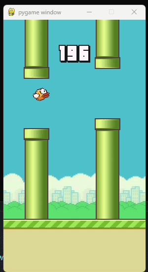

# Flappy Bird with Deep Q-Learning

A Deep Reinforcement Learning agent trained to play Flappy Bird and CartPole using Deep Q-Networks (DQN) with Double DQN and Dueling DQN extensions, built from scratch using PyTorch.

---

## Demo

I first trained the CartPole because it is easier to train with much less resources.

In FlappyBird, the agent learns to pass pipes in Flappy Bird through trial and error, starting with completely random actions and gradually improving its policy over hundreds of thousands of episodes.

---

## Features

- **Deep Q-Network (DQN)** - core reinforcement learning algorithm implemented from scratch

- **Double DQN** - decouples action selection from action evaluation to reduce Q-value overestimation

- **Dueling DQN** - splits the network into value and advantage streams for better state evaluation

- **Experience Replay** - stores and randomly samples past transitions for stable off-policy learning

- **Target Network** - separate network for computing stable Q-value targets

- **Epsilon-Greedy Exploration** - decaying exploration strategy balancing exploration and exploitation

- **Checkpoint Resuming** - automatically resumes training from last saved model and epsilon value

- **Cloud Training Support** - built-in Kaggle output saving for long training sessions

---

## Project Structure

```
├── agent.py                  # Main training and testing agent
├── dqn.py                    # DQN and Dueling DQN network architecture
├── experience_replay.py      
├── hyperparameters.yml       
├── runs/
│   ├── flappybird1.pt        # Saved model weights
│   ├── flappybird1.png       # Training graph
│   ├── flappybird1.log       # Training logs
│   ├── flappybird1_epsilon.txt       # Saved epsilon for resuming
│   └── flappybird1_best_reward.txt   # Saved best reward for resuming
└── README.md
```

---

## Architecture

### Dueling DQN Network

```
Input Layer (observation space)
        ↓
   Hidden Layer (fc1)
        ↓
   ┌────┴────┐
   ↓         ↓
Value      Advantage
Stream      Stream
   ↓         ↓
 V(s)      A(s,a)
   └────┬────┘
        ↓
  Q(s,a) = V(s) + A(s,a) - mean(A(s,a))
```

### Double DQN Logic

```
Policy Network  → selects best action
Target Network  → evaluates that action's Q-value
Combined        → eliminates overestimation bias
```

---

## Installation

```bash
# Clone the repository
git clone https://github.com/mudassirahmad/Flappy-Bird--with-Deep-Q-Learning.git
cd Flappy-Bird--with-Deep-Q-Learning

# Create conda environment
conda create -n dqnenv python=3.11
conda activate dqnenv

# Install dependencies
pip install torch flappy-bird-gymnasium gymnasium numpy matplotlib pyyaml
```

---

## Usage

### Training

If you have a good GPU you can train on your local machine but if you don't have that you can train it on Kaggle's free GPU on Kaggle (Recommended).

Also, if Kaggle's GPU shuts off in mid-training you can download the output and upload them again and start a new training session and it will resume from where you left. 

I've also attached my notebook that I used in Kaggle for training. 

```bash
# Train on CartPole
python agent.py cartpole1 --train

# Train on Flappy Bird
python agent.py flappybird1 --train
```


### Testing

```bash
# Test CartPole agent 
python agent.py cartpole1

# Test Flappy Bird agent
python agent.py flappybird1
```

### Demo



## How It Works

### Training Loop

1. Agent observes the current state from the environment
2. With probability epsilon, takes a random action (exploration)
3. Otherwise selects the action with the highest Q-value (exploitation)
4. Stores the transition `(state, action, next_state, reward, terminated)` in replay memory
5. Samples a random mini-batch from replay memory
6. Computes target Q-values using Double DQN formula
7. Updates policy network weights via gradient descent
8. Periodically syncs target network with policy network
9. Decays epsilon after each step

### Key Concepts

**Experience Replay** — Breaks correlation between consecutive samples by storing and randomly sampling past experiences, leading to more stable training.

**Target Network** — A separate copy of the policy network updated periodically, providing stable Q-value targets and preventing oscillating updates.

**Double DQN** — Uses the policy network to select actions but the target network to evaluate them, reducing the overestimation bias common in standard DQN.

**Dueling DQN** — Separates Q-value estimation into state value V(s) and action advantage A(s,a), allowing the network to learn which states are valuable independently of actions.

---

## Requirements

- Python 3.11+
- PyTorch
- Gymnasium
- flappy-bird-gymnasium
- NumPy
- Matplotlib
- PyYAML


- [Flappy Bird Gymnasium](https://github.com/markub3327/flappy-bird-gymnasium) for the Flappy Bird environment
- [OpenAI Gymnasium](https://gymnasium.farama.org/environments/classic_control/cart_pole/) for the CartPole environment
